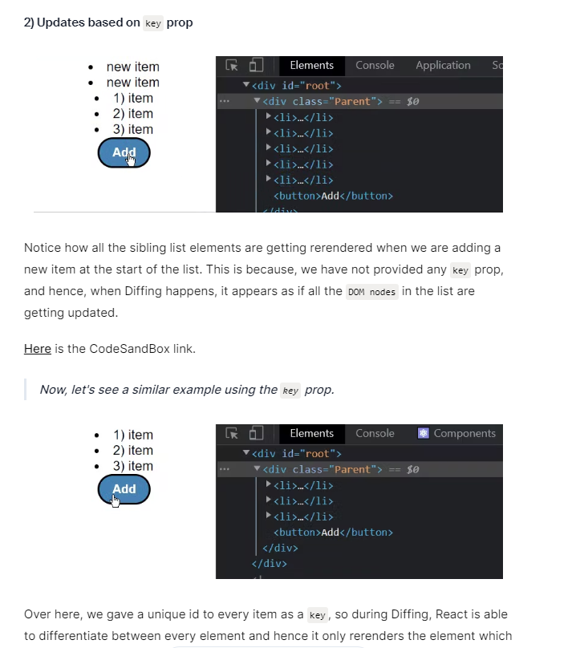

```
const people = [
  'Creola Katherine Johnson:mathematician',  
  'Mario José Molina-Pasquel Henríquez: chemist',  
  'Mohammad Abdus Salam: physicist',  
  'Percy Lavon Julian: chemist',  
  'Subrahmanyan Chandrasekhar: astrophysicist'  
];

export default function List() {
  const listItems = people.map(person =>
    <li>{person}</li>
  );
  return <ul>{listItems}</ul>;
}
```
You need to give each array item a key — a string or a number that uniquely identifies it among other 
items in that array.

Keys tell React which array item each component corresponds to, so that it can match them up later. 
This becomes important if your array items can move (e.g. due to sorting), get inserted, or get deleted.
A well-chosen key helps React infer what exactly has happened, and make the correct updates to the DOM tree.


For example, if you have:
```
<ul>
  <li><ComponentOne>Sarah</ComponentOne></li>
  <li><ComponentOne>John</ComponentOne></li>
</ul>
```
and you reverse the order without keys, React might still show "Sarah" in the first `<li>` and "John" in the second `<li>`, even though the data has changed.



**never use indexes as keys**
https://dev.to/shiv1998/why-not-to-use-index-as-key-in-react-lists-practical-example-3e66  
When is it safe to use index as key in a list?  
- Data is static.
- When you know reordering of lists: Sorting, Filtering is not going to happen.
- In the absence of an id.