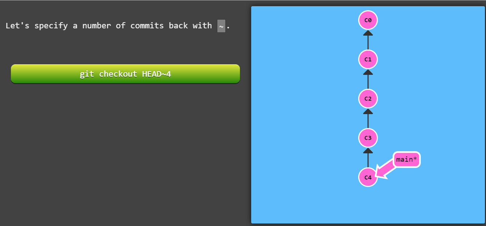

### Commits
A commit in a git repository records a snapshot of all the (tracked) files in your directory. It's like a giant copy and paste, but even better!

Git wants to keep commits as lightweight as possible though, so it doesn't just blindly copy the entire directory every time you commit. It can (when possible) compress a commit as a set of changes, or a "delta", from one version of the repository to the next.

### Branches
Branches in Git are incredibly lightweight as well. They are simply pointers to a specific commit -- nothing more.  
to create one simply do : `git branch branch-name`  
to check all the branches : `git branch`

### Checkout
- To switch from one branch to another : `git checkout <branch_name>` 
- A shortcut to switch to a branch that is yet to be created with the -b flag : `git checkout -b feature-branch-name`   
- To switch from one commit to another : `git checkout commit-hash`

### Reset
Reset Working Directory to Last Commit :`git reset --hard HEAD~1`  
destroys latest commit and also throws away any uncommitted changes.

Reset Working Directory to Last Commit :`git reset --soft HEAD~1`  
Undo the commit but keep your changes.

### Restore
use `git restore --staged <file>...` to unstage

### Merging
Great! We now know how to commit and branch. Now we need to learn some kind of way of combining the work from two different branches together. This will allow us to branch off, develop a new feature, and then combine it back in.

### Rebasing

also can do `git rebase base-branch top-branch`

### Head
HEAD is the symbolic name for the currently checked out commit -- it's essentially what commit you're working on top of.  
When you're on a specific branch, HEAD points to the latest commit on that branch. Sometimes, instead of pointing to the tip of a branch, HEAD can directly point to a specific commit (detached HEAD state).

git checkout branch -> head moves to this branch

### Moving Around with Relative Refs
^ : git checkout main^ => goto parent commit of current reference of main branch
    git checkout head^ => same purpose but more useful  
~ : Say you want to move a lot of levels up in the commit tree. It might be tedious to type ^ several times,so  Git also has the tilde (~) operator.
    The tilde operator (optionally) takes in a trailing number that specifies the number of parents you would like to ascend. Let's see it in action.

### Clone
git clone is the command you'll use to create local copies of remote repositories (from github for example).
- **argument = -b <name> or --branch** <name>
 : Instead of pointing the newly created HEAD to the branch pointed to by the cloned repository’s HEAD, point to <name> branch instead. In a non-bare repository, this is the branch that will be checked out.

### Checkout remote Branch
git checkout remote branch puts head in detached state because the remote branch can not be updated locally. If we commit the remote branch wont be updated and header would just point to the new commit. Basically we are doing just local changes on top of the remote branch. The remote branch keeps pointing to the old commit in sync with rmeote repo.

### fetch
git fetch essentially brings our local representation of the remote repository into synchronization with what the actual remote repository looks like (right now).

Now that we've seen how to fetch data from a remote repository with git fetch, let's update our work to reflect those changes!

There are actually many ways to do this -- once you have new commits available locally, you can incorporate them as if they were just normal commits on other branches. This means you could execute commands like:

git rebase o/main
git merge o/main
etc., etc.

### git Pull
- git pull origin branch-name

### git push
- git push origin branch-name
git push is responsible for uploading your changes to a specified remote and updating that remote to incorporate your new commits. Once git push completes, all your friends can then download your work from the remote.

### divergent branches
Imagine you clone a repository on Monday and start dabbling on a side feature. By Friday you are ready to publish your feature -- but oh no! Your coworkers have written a bunch of code during the week that's made your feature out of date (and obsolete). They've also published these commits to the shared remote repository, so now your work is based on an old version of the project that's no longer relevant.

In this case, the command git push is ambiguous. If you run git push, should git change the remote repository back to what it was on Monday? Should it try to add your code in while not removing the new code? Or should it totally ignore your changes since they are totally out of date?

Because there is so much ambiguity in this situation (where history has diverged), git doesn't allow you to push your changes. It actually forces you to incorporate the latest state of the remote before being able to share your work.
 
Solution 1 :
- git fetch
- git rebase
- git push
or 
- git pull --rebase
- git push

Solution 2 :
- git fetch
- git merge
- git push
or 
- git pull 
- git push

### Remote tracking
This connection between main and o/main is explained simply by the "remote tracking" property of branches. The main branch is set to track o/main -- this means there is an implied merge target and implied push destination for the main branch.

You may be wondering how this property got set on the main branch when you didn't run any commands to specify it. Well, when you clone a repository with git, this property is actually set for you automatically.

During a clone, git creates a remote branch for every branch on the remote (aka branches like o/main). It then creates a local branch that tracks the currently active branch on the remote, which is main in most cases.

Once git clone is complete, you only have one local branch (so you aren't overwhelmed) but you can see all the different branches on the remote (if you happen to be very curious). It's the best of both worlds!

This also explains why you may see the following command output when cloning:

local branch "main" set to track remote branch "o/main"
